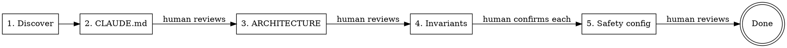

# KEEL Adopt

Guided brownfield adoption of the KEEL framework for an existing codebase.
Automates discovery and drafting. Human confirms at every gate.

Full guide: `docs/process/BROWNFIELD.md`

## Framework principles

Adoption places the framework's seven principles into the user's
project via `KEEL-PRINCIPLES.md` (copied by install.py). This skill
also stamps the `KEEL-INVARIANT-7` marker in Phase 5d. See
[`docs/process/KEEL-PRINCIPLES.md`](../../../docs/process/KEEL-PRINCIPLES.md).

## When to Use

- Existing project, no KEEL structure yet
- Want to start using KEEL's pipeline for new features
- NOT for greenfield — use `/keel-setup` instead

## Phases



---

## Phase 1: Discovery (automated)

Scan the codebase to understand what exists. Read broadly, summarize concisely.

**Do:**
1. Glob for source files by type — identify the primary language and framework
2. Read package/dependency files (`package.json`, `mix.exs`, `Cargo.toml`, `requirements.txt`, `go.mod`, etc.)
3. Read entry points, main modules, and config files
4. Identify the test framework and test file locations
5. Identify build/run/test commands (from Makefile, scripts, CI config, README)
6. Read existing README, CONTRIBUTING.md, or similar docs
7. Map the directory structure (top 2 levels)

**Output:** A discovery summary with:
- Stack (language, framework, runtime)
- Directory structure
- Entry points and key modules
- Test framework and commands
- Build/run commands
- Existing documentation found

**Do NOT:** Write any files yet. This phase is read-only.

Announce: "Discovery complete. Here's what I found: [summary]. Moving to Phase 2."

---

## Phase 2: Draft CLAUDE.md (automated → human reviews)

Generate a draft CLAUDE.md from discovery findings.

**Template to follow:**
```markdown
# [Project Name]

[One paragraph: what this project does, derived from code/README]

## Quick Facts

- **Stack:** [from discovery]
- **Runtime:** [Docker / local / etc.]
- **Tests:** [framework], run with `[command]`

## Safety Rules

<!-- HUMAN: Review these — are they your actual non-negotiable rules? -->
1. [Proposed from Phase 4, or placeholder]

## Architecture

See [ARCHITECTURE.md](ARCHITECTURE.md)

## Development

[Build, run, test commands from discovery — 4-6 lines]
```

**Write** the draft to `CLAUDE.md`.

**STOP.** Tell the human:
> "I've drafted CLAUDE.md from what I found in the codebase. Please review
> and edit it — especially the project description and any sections marked
> with HUMAN comments. When you're satisfied, tell me to continue."

**Wait for confirmation before proceeding.**

---

## Phase 3: Draft ARCHITECTURE.md (automated → human reviews)

Generate a draft ARCHITECTURE.md from the codebase structure.

**What you CAN derive from code (include these):**
- Module/file map with import relationships
- Directory structure as layer diagram
- Data flow for a typical request (trace from entry point)
- Dependencies between components

**What you CANNOT derive from code (mark these):**
- Why architectural decisions were made
- Historical context for structural choices
- Intentional patterns vs accidental ones
- Which modules are considered stable vs experimental

**For every section you can't derive, insert:**
```markdown
<!-- HUMAN: [specific question about what you need to know] -->
```

Examples:
```markdown
<!-- HUMAN: Why is auth handled in middleware rather than per-route? Intentional or legacy? -->
<!-- HUMAN: Is the services/ vs lib/ split meaningful, or did it just grow that way? -->
```

**Write** the draft to `ARCHITECTURE.md`.

**STOP.** Tell the human:
> "I've drafted ARCHITECTURE.md with the structural parts I could derive
> from code. Sections marked <!-- HUMAN --> need your input — these are
> the 'why' questions only you can answer. Edit those, then tell me to continue."

**Wait for confirmation before proceeding.**

---

## Phase 4: Propose Domain Invariants (interactive — per-item confirmation)

This is the most important phase. Wrong invariants propagate through the
safety-auditor into every future feature.

**Scan the codebase for candidate invariants.** Look for:
- Validation patterns (input checking, type assertions, auth guards)
- Error handling conventions (what's caught, what's propagated)
- Security patterns (auth, sanitization, encryption)
- Data integrity patterns (transactions, constraints, idempotency)
- Forbidden patterns (raw SQL, force flags, unsafe operations)

**Multi-model pressure test (optional — only if roundtable MCP is available).**

Before presenting candidates to the human, stress-test the draft slate with
the `roundtable` MCP server. Invariants encoded here propagate into every
future feature via the safety-auditor — a second opinion before the human
review is cheap insurance. If roundtable is unavailable, skip this step
silently and proceed.

1. **Critique pass** — call `mcp__roundtable__roundtable-critique` with the draft
   invariants plus codebase evidence. Ask it to attack the slate: missing
   patterns visible in the scan, grep patterns that will produce false
   positives or miss real violations, rules that conflict with the codebase's
   existing conventions.
2. **Canvass consensus** — take the critique output plus the original
   draft and call `mcp__roundtable__roundtable-canvass` to synthesize a consensus
   slate: which invariants survive, which get reworded, which get dropped,
   which get added.
3. Use the consensus slate as the candidate list below. Mark each candidate's
   source so the human knows what to scrutinize.

**Present each candidate individually. Do NOT present a bulk document.**

Format for each:
```
CANDIDATE INVARIANT #N:
  Rule: [the invariant in plain language]
  Evidence: [where in code you see this pattern]
  Grep pattern: [how safety-auditor would detect violations]
  Confidence: [high/medium/low — based on how consistently the pattern appears]
  Source: [draft | roundtable-added | roundtable-reworded]

  Accept this invariant? [y/n/edit]
```

The human is still the final authority — roundtable informs, it does not decide.

Wait for the human to respond to EACH candidate before presenting the next.

**Collect confirmed invariants** into a list for Phase 5.

If the human adds invariants you didn't find, include those too.

After all candidates are reviewed, announce:
> "We have N confirmed invariants. Moving to Phase 5 to wire them into
> the safety-auditor and hooks."

---

## Phase 5: Scaffold Safety Config (automated → human reviews)

Wire confirmed invariants into the KEEL safety enforcement layer.

**5a. Write `docs/design-docs/core-beliefs.md`**

Use the template from `template/docs/design-docs/core-beliefs.md`. Fill in:
- Domain safety section with confirmed invariants
- Testing strategy adapted to the project's existing test framework
- Design philosophy from what you observed in the codebase

**5b. Configure `.claude/agents/safety-auditor.md`**

In the agent definition, replace the `<!-- CUSTOMIZE -->` sections with:
- The confirmed invariant rules
- The grep patterns from Phase 4
- The critical file paths for this project

**5c. Configure `.claude/hooks/keel-safety-gate.py`**

Set the `CRITICAL_PATTERNS` variable to match the project's critical files:
```bash
CRITICAL_PATTERNS="*/auth/*|*/middleware/*|*/transactions/*"
```

**5d. Stamp brownfield bootstrap marker**

Brownfield projects already have runtime, scaffold, and test infrastructure
— that's the definition. KEEL's bootstrap features (F01–F03) are greenfield-
only. Mark this in the backlog so `/keel-refine` knows bootstrap is satisfied.

Three independent, idempotent sub-steps. Each sub-step has its own
fingerprint gate — any deviation from the shipped template means "user
customized this" and we skip that sub-step.

Target file: `docs/exec-plans/active/feature-backlog.md`.

**5d.1 Stamp marker (always, idempotent).**

- If the backlog file does not exist: create it using the canonical
  brownfield template below, with the marker pre-stamped.
- If the file exists and already contains the exact string
  `<!-- KEEL-BOOTSTRAP: not-applicable -->`: no-op.
- Otherwise: insert `<!-- KEEL-BOOTSTRAP: not-applicable -->` on its own
  line after the `**Architecture:** ...` preamble line and immediately
  before the first `---` divider. Exact string, no variants.

**5d.2 Strip Bootstrap section (gated).**

Only if the Bootstrap section contains these three exact unticked entries
(bit-exact, including the `[ ]`, the `**F0N Title**` formatting, the Spec
and Test lines):

```markdown
- [ ] **F01 Docker dev environment**
  Spec: core-beliefs:Container | Agent: docker-builder
  Test: `docker compose build` succeeds, container has required tools

- [ ] **F02 Project scaffold**
  Spec: [YOUR-SPEC]:technical | Needs: F01 | Agent: scaffolder
  Test: App boots at expected port inside container

- [ ] **F03 Test infrastructure**
  Spec: core-beliefs:Testing | Needs: F02 | Agent: config-writer
  Test: Mock framework configured, test helper compiles
```

Replace the entire `## Bootstrap (...)` block (heading + body up to the next
`##` heading) with a one-line comment:

```markdown
<!-- Bootstrap not applicable — brownfield adoption on {ISO-date}. -->
```

Any deviation (F01 renamed, F02 ticked, extra entries added, etc.) → skip
this sub-step. Log: `"5d.2 skipped: Bootstrap section customized."`

**5d.3 Clear placeholder entries (gated, per section).**

For each of Foundation / Service / UI / Cross-cutting: only if that section
contains exactly one entry whose title matches the bit-exact shipped
placeholder pattern AND whose Spec line contains the literal `[spec:section]`:

| Section | Placeholder title |
|-|-|
| Foundation | `**F04 [YOUR FOUNDATION FEATURE]**` |
| Service | `**F05 [YOUR SERVICE FEATURE]**` |
| UI | `**F06 [YOUR UI FEATURE]**` |
| Cross-cutting | `**F07 [YOUR CROSS-CUTTING FEATURE]**` |

Remove that single entry (and its body: Spec, Needs, Design, Test lines,
plus the blank line separator). Preserve the section heading and its
`<!-- CUSTOMIZE: ... -->` comment.

Any deviation in a section (title customized, body changed, extra entries,
missing Spec line) → skip that section only. Log: `"5d.3 skipped {section}:
customized."`

**5d.ii — Stamp the KEEL-INVARIANT-7 marker**

After bootstrap marker placement, scan the backlog for the highest
existing F## ID. Stamp the grandfather marker in the backlog preamble:

```
<!-- KEEL-INVARIANT-7: legacy-through=F<max> -->
```

Announce (CTA-style):

> *"Placed KEEL-INVARIANT-7 marker with `legacy-through=F<max>`
> based on current max feature ID. Entries F01-F<max> are
> grandfathered; new entries from F<max+1> forward must carry
> `PRD:` or `PRD-exempt:`. Edit the marker value in the backlog
> if this is wrong."*

**Canonical brownfield backlog** (used by 5d.1 when the file is missing):

````markdown
# Feature Backlog

Smallest independently testable features. Execute top-to-bottom.
Each feature: read spec → write test → write code → verify.

**PRDs:** `docs/exec-plans/prds/<slug>.json` (drafted by `/keel-refine`)
**Principles:** `docs/design-docs/core-beliefs.md`
**Architecture:** `ARCHITECTURE.md`

<!-- KEEL-BOOTSTRAP: not-applicable -->

---

## Foundation

<!-- BROWNFIELD: Start real features at F01. Foundation-layer modules. -->

## Service

<!-- BROWNFIELD: Features that build on foundation. -->

## UI

<!-- BROWNFIELD: UI entries may include a Design: line with repo-local asset paths. -->

## Cross-cutting

<!-- BROWNFIELD: Tests, fixtures, safety checks, shared infrastructure. -->
````

**STOP.** Tell the human:
> "I've stamped `feature-backlog.md` with the brownfield bootstrap marker.
> Actions taken: {list of completed sub-steps}. Skipped (content was
> customized): {list of skipped sub-steps, or 'none'}. Review the backlog
> and confirm it's clean. When satisfied, tell me to continue."

Wait for confirmation before proceeding to 5e.

**5e. Configure pipeline preferences**

Fill the `## Pipeline Preferences` section in CLAUDE.md:
- Roundtable review: `true` (default — gracefully skipped if MCP unavailable)

**Write** all files.

**STOP.** Tell the human:
> "Safety enforcement and pipeline preferences are configured. Review
> core-beliefs.md, the safety-auditor agent definition, keel-safety-gate.py,
> and the pipeline preferences in CLAUDE.md. These control what the
> auditor enforces and whether roundtable review runs. When satisfied,
> we're done with adoption."

---

## After Adoption

Print the brownfield checklist from `docs/process/BROWNFIELD.md`:

```
[x] Agent has read the full codebase
[x] CLAUDE.md written
[x] ARCHITECTURE.md written
[x] Domain invariants defined in core-beliefs.md
[x] Safety-auditor configured
[x] Safety-gate hook configured
[x] Brownfield bootstrap marker stamped in feature-backlog.md
[ ] First real feature drafted — use /keel-refine, or edit feature-backlog.md by hand
[ ] First feature spec written — YOUR TURN
[ ] First feature run through pipeline — use /keel-pipeline
```

Tell the human:
> "KEEL adoption is complete. `feature-backlog.md` is marker-stamped and
> ready for real features starting at F01. Next: draft entries with
> `/keel-refine` (PRD or prose input) or edit the backlog by hand, then
> write the spec for your first feature and run `/keel-pipeline` to execute it."

## Rules

- **Every phase has a human checkpoint.** Never proceed without confirmation.
- **Phase 4 is per-item, not bulk.** Present one invariant at a time.
- **Draft, don't prescribe.** CLAUDE.md and ARCHITECTURE.md are drafts for human refinement.
- **Mark what you don't know.** Use `<!-- HUMAN: ... -->` markers (with colon, specific question), never guess at intent.
- **Don't touch existing code.** This skill writes KEEL docs, not project code.
- **Don't automate backlog/specs.** Steps 6-8 from BROWNFIELD.md are human judgment. **Exception:** Phase 5d stamps the bootstrap marker and removes bit-exact template scaffolding (per-sub-step fingerprint-gated). It never authors user-facing content — every sub-step is either a deterministic marker insertion or a bit-exact placeholder removal.
