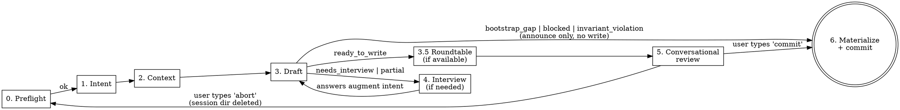

## Framework principles

This skill's invariants: P4 (no redundant storage — drafted entries
uniquely author the F##'s contract, PRD files author the cohesion
narrative), P7 (halt-with-CTA — every exit path produces an
actionable message). See
[`docs/process/KEEL-PRINCIPLES.md`](../../../docs/process/KEEL-PRINCIPLES.md).

# KEEL Refine

PRD + backlog refinement for an existing KEEL project. Given a prose description, a markdown PRD, a bundle directory with design assets, or images pasted in chat, drafts a **structured JSON PRD** at `docs/exec-plans/prds/<slug>.json` (schema v1, validated against `schemas/prd.schema.json`) plus the matching F## entries in `docs/exec-plans/active/feature-backlog.md`. Reviews both in conversation before committing.

This skill is the single conversion hub between non-JSON feature input (prose, markdown, bundles, images) and the one shape the pipeline reads (JSON PRD). Markdown PRDs are raw material here, never pipeline input. See NORTH-STAR §"Feature input canon — single path, JSON PRDs only".

## When to Use

- You have a PRD (or rough feature description) and want backlog entries drafted.
- You have hi-fi comps, wireframes, or UX flows — paste them in chat or point at a bundle directory.
- The project is already bootstrapped — F01-F03 shipped, `ARCHITECTURE.md` describes real layers.
- You are starting a new feature and don't want to write `F##` entries by hand.

**Not for:**
- Initial project setup → use `/keel-setup` (greenfield) or `/keel-adopt` (brownfield).
- Running a feature → use `/keel-pipeline F## docs/exec-plans/prds/<slug>.json` after the human has reviewed and committed the drafted JSON PRD plus backlog entries.
- Hand-editing JSON → the PRD is KEEL-authored. Humans steer via the card walk in Phase 5; they do not edit `<slug>.json` in an external editor. Re-run `/keel-refine` on an existing PRD to revise it through the same gates.

## Design Principle

**Draft first, review conversationally, commit on verb.** Same draft-first ethos as `keel-setup` and `keel-adopt`, with one upgrade: the review surface for the drafting phase is the chat conversation, not the user's editor. The human edits entries in plain English, types `commit` when ready, and the skill commits with a deterministic message — no confirmation prompt. Feature-branch commits are trivially reversible (`git commit --amend`, `git reset`); announcing is safer than prompting.

**Repo is truth, enforced strictly.** Pasted images are staged to `.keel-refine-session/<id>/` (gitignored, outside `docs/`). They move into `docs/exec-plans/prds/<slug>/assets/` only at commit time. Abort → session dir deleted → zero pollution of tracked territory.

## Phases



Branch targets on failure before review:
- `bootstrap_gap` → announce gap, route to `/keel-adopt`, exit. No write.
- `invariant_violation` → announce, exit. No write.
- `blocked` (other) → announce reason, exit. No write.

---

## Phase 0: Preflight (automated, silent)

Before touching anything, verify the repo is in a state where drafting makes sense.

**Do:**
1. Verify `CLAUDE.md`, `ARCHITECTURE.md`, and `docs/exec-plans/active/feature-backlog.md` all exist.
2. Parse the backlog and check the bootstrap gate. Accept **either**:
   - (a) F01, F02, F03 all have `[x]` markers (greenfield-complete), **or**
   - (b) the exact string `<!-- KEEL-BOOTSTRAP: not-applicable -->` is present anywhere in the file.

   Reject otherwise. Do **not** accept "Bootstrap section absent" as valid state — that is indistinguishable from accidental deletion. The marker match is exact (case-sensitive, whitespace-sensitive); any variant fails.
3. For path (a) only: verify the referenced spec files for F01-F03 all exist (if the backlog format lists them). Path (b) skips this check — brownfield bootstrap never existed.
4. Verify `.gitignore` contains a `.keel-refine-session/` line. If missing, append it (single `Edit` call). Announce the addition.
5. Generate a session id: `<ISO-timestamp>-<6-char-random>` (e.g., `20260420-0347-x7k2bp`). Create `.keel-refine-session/<id>/` as the ephemeral workspace for this invocation.

**If check 1 fails (missing files):**
- Print: `"KEEL Refine requires a bootstrapped project. Missing: <what>. Run /keel-setup (greenfield) or /keel-adopt (existing repo) first."`
- Exit. Do not prompt, do not create the session dir, do not proceed.

**If check 2 fails (bootstrap gate not satisfied):**

Print this three-option message verbatim and exit without changes:

```text
KEEL Refine requires a bootstrapped project. Bootstrap gate not satisfied.

Pick one:

  [A] Greenfield: tick F01–F03 as [x] in
      docs/exec-plans/active/feature-backlog.md.

  [B] Brownfield (primary path): your project already has runtime,
      scaffold, and test infra. Paste this exact line between the
      preamble and the first --- divider in feature-backlog.md:

          <!-- KEEL-BOOTSTRAP: not-applicable -->

      That's the only change needed. Shipped F01–F07 placeholders
      are ignored by the parser when the marker is present.

  [C] Brownfield, first-time adoption: run /keel-adopt (it will
      stamp the marker + clear template scaffolding in Phase 5d).
      WARNING: if /keel-adopt has already run, do NOT re-run —
      it will overwrite CLAUDE.md and ARCHITECTURE.md. Use [B].

Exiting without changes.
```

**If check 3 fails (missing spec files on greenfield path):** use the existing "Missing: <what>" message from check 1.

**Do NOT:** Write source code. Write is restricted to `.gitignore` (one line append if missing) and `.keel-refine-session/**` (session workspace).

---

## Phase 1: Intent Ingestion

Parse the user's invocation into a normalized `intent_blob`.

**Four invocation shapes:**

| Invocation | `intent.source` | `intent.content` | `intent.path` | Design assets source |
|-|-|-|-|-|
| `/keel-refine docs/prds/auth.md` | `prd_path` | full text of the file | absolute path | markdown `` refs in the file's dir |
| `/keel-refine docs/prds/auth-redesign/` | `prd_path` | full text of `<dir>/README.md` | absolute dir path | markdown refs + sibling image/pdf files in the directory |
| `/keel-refine "let users edit profile inline"` | `prose` | quoted string | `null` | pasted images in this chat turn, if any |
| `/keel-refine` | `interview` | `""` (filled via interview) | `null` | pasted images in any turn, if any |

**Do:**
1. Parse the positional argument:
   - File path ending `.md` → `prd_path`, file mode.
   - Directory path → `prd_path`, bundle mode. Expect a `README.md` inside; error if absent.
   - Non-path string → `prose`.
   - Absent → `interview`.
2. For `prd_path` file mode: verify file exists and is markdown. If not, print fix suggestion and exit.
3. For `prd_path` bundle mode: verify directory exists and contains a readable `README.md`. Enumerate siblings.
4. For `prose`: accept any non-empty string.
5. For `interview`: ask the minimum viable set:
   - "What feature are you refining? Give me a one-line summary."
   - "What's the user-facing goal?"
   - "Any related specs, prior features, or constraints I should know about?"
   Accumulate answers into `intent.content`.
6. Detect pasted images in the current conversation turn. For each attached image, write it to `.keel-refine-session/<id>/pasted-<n>.<ext>` using the inferred extension from mime type.

**Format and size caps (applied to every candidate design asset):**

| Format | Accepted | Notes |
|-|-|-|
| PNG | yes | standard raster |
| JPG / JPEG | yes | standard raster |
| GIF | yes | treat as static frame 0 |
| SVG | yes | vector |
| PDF | yes | max 20 pages; enforce via `Read` tool's `pages` constraint downstream |
| anything else | no | reject with: `"File <name> format <.ext> is not supported. Export as PNG/SVG/PDF and re-paste."` |

Per-file size cap: **20 MB.** Over cap → reject: `"File <name> is <X>MB (cap 20). Compress, split into frames, or reduce resolution."` No partial-session state; the file is never written to disk.

**Output:** Normalized `intent_blob` in memory with `intent.ui_design_assets: [{path, kind, bytes, label}]` populated from the three possible sources (bundle siblings, markdown refs, pasted attachments). Not yet surfaced to the user.

---

## Phase 2: Repo Context Gathering

Build the `repo_context` that `backlog-drafter` needs.

**Do:**
1. Parse `ARCHITECTURE.md` → extract `architecture_layers`. Canonical sources:
   - Section headings under `## Layers` or `## Module Map`
   - If none, fall back to the section headings in `feature-backlog.md` (excluding `Bootstrap`)
2. Parse `feature-backlog.md` → extract `existing_features` as a list of `{id, title, layer, status, needs, source_tag}`.
   - `status: shipped` if entry has `[x]`, else `planned`.
   - `source_tag`: read any `<!-- SOURCE: ... -->` comment on the entry.
   - `layer`: case-fold the section heading the entry sits under (Unicode NFKC + lowercase) into the schema enum `{service, ui, cross-cutting, foundation}`. Step 8 below pre-flights that every architecture layer folds; in extraction here, apply the same fold so `existing_features[].layer` is uniform with the JSON PRD shape.
3. **Brownfield-marker filter.** If the backlog contains the exact string `<!-- KEEL-BOOTSTRAP: not-applicable -->`, exclude from `existing_features` (and therefore from `next_free_id` allocation):
   - the entire `## Bootstrap` section (all entries within it, regardless of content)
   - any exact-match shipped placeholder entries whose title matches one of:
     - `**F04 [YOUR FOUNDATION FEATURE]**`
     - `**F05 [YOUR SERVICE FEATURE]**`
     - `**F06 [YOUR UI FEATURE]**`
     - `**F07 [YOUR CROSS-CUTTING FEATURE]**`

   Match must be exact on title (case and whitespace sensitive). A customized F04 (real title) is kept in `existing_features`; only bit-exact shipped placeholders are filtered. Result: an untouched brownfield template plus the marker yields `next_free_id = F01`.
4. Compute `next_free_id`: lowest F## integer not present in EITHER the filtered `existing_features` OR the `features[].id` set of the target JSON PRD (in re-run mode, when the PRD file already exists at `docs/exec-plans/prds/<slug>.json`). Both sources are reserved so the drafter can never synthesize an ID that collides with an F## already authored in this PRD. **Freeze this value for the entire refinement session** — even across interview loops and review turns.
5. Parse `CLAUDE.md` → extract `invariants` as a list of objects `{id, name, text}`. For each list item under `## Safety Rules`:
   - `id` — first match of `INV-[0-9]{3,}` in the rule line, or `null` if the rule is not registered with an ID.
   - `name` — short label preceding the `:` or `—` separator on registered rules; `null` otherwise.
   - `text` — the full rule text verbatim.

   The drafter cites IDs from this list when populating `invariants_exercised`; rules with `id: null` are visible to the drafter for invariant-violation detection but cannot be cited as exercised (the schema requires `^INV-[0-9]{3,}$`).
6. Derive `spec_dir`: default `docs/product-specs/` unless CLAUDE.md explicitly points elsewhere. Passed to the drafter for legacy compatibility only — under the JSON-only doctrine the JSON PRD's `contract` + `oracle` IS the spec, and the drafter no longer emits `spec_ref`.
7. Enumerate existing PRD slugs by listing `docs/exec-plans/prds/*.json` (filenames minus `.json` extension). Pass to `backlog-drafter` as `prd.existing_slugs` for collision avoidance when synthesizing a new slug.
8. **Schema enum preflight.** Case-fold each entry in `architecture_layers` (Unicode NFKC + lowercase) and verify it matches the PRD schema's `layer` enum: `{service, ui, cross-cutting, foundation}`. If any layer doesn't fold to an enum value (e.g. the repo declares `Backend`, `Database`, `Frontend/UX`), halt with CTA before the drafter dispatches:
   > *"ARCHITECTURE.md layer `<value>` does not case-fold to the schema's `layer` enum `{service, ui, cross-cutting, foundation}`. JSON PRDs cannot encode this layer. Rename the layer in ARCHITECTURE.md to one of the four schema values (the four are the framework's universal partitioning), or extend `schemas/prd.schema.json` in a framework-level change before drafting."*

   The preflight prevents the card walk from hard-halting mid-session on a fundamentally unrecoverable state. After preflight succeeds, replace `architecture_layers` with the case-folded enum form before passing to the drafter — the drafter receives schema-enum values directly and emits them verbatim into `drafted_entries[].layer`.
9. Snapshot `feature-backlog.md` contents (full text + SHA-256 of contents) to `.keel-refine-session/<id>/backlog-snapshot.md` and `.keel-refine-session/<id>/backlog-snapshot.sha`. Used for staleness detection at commit time. In re-run mode over an existing JSON PRD, additionally snapshot `docs/exec-plans/prds/<slug>.json` (full text + SHA-256) for the same staleness window.

**Do NOT:**
- Invent layers not declared in `ARCHITECTURE.md` or present in the backlog.
- Change `next_free_id` mid-session — idempotency depends on it being frozen.
- Write outside `.keel-refine-session/<id>/`.

---

## Phase 3: Agent Dispatch

Invoke the `backlog-drafter` agent with the YAML blob.

**Do:**

Dispatch via the `Agent` tool with `subagent_type: "backlog-drafter"`. Pass exactly this prompt shape:

```
You are backlog-drafter. Read .claude/agents/backlog-drafter.md for your contract.

Here is your input blob:

intent:
  source: <prd_path | prose | interview>
  content: |
    <intent.content verbatim>
  path: <path or null>
  ui_design_assets:
    - path: <absolute or repo-relative path>
      kind: <png | jpg | svg | pdf>
      bytes: <int>
      label: <alt text from markdown ref, or null>
    # ... zero or more

repo_context:
  architecture_layers: [<schema-enum form, post Phase 2 Step 8 case-fold>]
  existing_features:
    - {id, title, layer, status, needs, source_tag}   # layer is lowercase schema enum
    ...
  next_free_id: F##
  invariants:                                          # objects, not strings
    - {id: INV-### or null, name: <label or null>, text: <full rule>}
    ...
  spec_dir: <path>                                     # legacy; drafter no longer emits spec_ref

prd:
  slug: null  # synthesize from intent, avoid collisions with existing_slugs (new-PRD mode)
             # OR: <slug>  # when operating on a known slug
  existing_slugs: [<list from Phase 2>]
  existing_reference: <bool>  # true iff docs/exec-plans/prds/<slug>.json exists on disk
                              # — drafter omits PRD-frame fields in re-run mode

constraints:
  append_only: true
  never_edit_existing: true
  layer_must_exist_in_architecture: true
  max_entries_per_run: 15
  ui_design_assets_shallow_read_only: true

Return your structured YAML output per .claude/agents/backlog-drafter.md §Output Format. Drafter emits schema-shaped fields (lowercase `layer`, `contract` open-object, `oracle.{type, assertions, ...}`, plus PRD-frame fields when existing_reference is false). No prose.
```

`existing_reference` is computed by the skill: it checks
`docs/exec-plans/prds/<slug>.json` for a pre-existing file. In
new-PRD mode (file does not exist), the drafter emits the full PRD
frame (`title`, `motivation`, `scope`, `design_facts`,
`invariants_exercised`) and the skill seeds Card 0 from those
verbatim. In re-run mode (file exists), the drafter omits the
frame; the skill loads it from the on-disk JSON for Card 0
seeding (or skips Card 0 entirely if the file already has a
schema-valid frame — see Phase 5 Step 2a).

**Parse the agent's return.** Expect the YAML schema in `.claude/agents/backlog-drafter.md` §Output Format. Validate:
- `status` is one of the six allowed values.
- If `status: ready_to_write` or `partial`: every `self_validation` field must be true.
- `prd.slug` is non-null when `status ∈ {ready_to_write, partial}`.
- Every `drafted_entries[].needs` id exists in `existing_features` or in the drafted set.
- Every `drafted_entries[].layer` is in `{service, ui, cross-cutting, foundation}`.
- Every `drafted_entries[].contract` is a non-empty object (≥ 1 key — placeholder counts).
- Every `drafted_entries[].oracle.type` is in `{unit, integration, e2e, smoke}` and `oracle.assertions` is a non-empty array of strings.
- Every path in any `drafted_entries[].ui_design_assets` appears in `intent.ui_design_assets[].path`.
- Only UI-layer entries carry `ui_design_assets`; others have empty or absent lists.
- When `prd.existing_reference: false` AND `status ∈ {ready_to_write, partial}`: the PRD-frame fields (`prd.title`, `prd.motivation`, `prd.scope.included`, etc.) are present and shape-valid (frame fields free of `\bF\d{2,}\b`; `motivation` ≤ 800 chars; `invariants_exercised[].invariant_id` matches `^INV-[0-9]{3,}$` and resolves in `repo_context.invariants[].id`).
- When `prd.existing_reference: true`: PRD-frame fields are absent (the skill reads them from disk).

**If the agent's output fails validation:** treat as a hard failure. Print the parsing error, clean up the session dir, exit. Do not attempt to fix the agent's output yourself.

---

## Phase 3.5: Roundtable decomposition review (optional)

Runs only when (a) `Roundtable review: true` in CLAUDE.md, (b) roundtable
MCP is available, and (c) the agent returned `status ∈ {ready_to_write, partial}`
with at least one drafted entry. Skip for all other statuses and skip silently
if the MCP is unavailable.

**Why:** Once the human types `commit`, `feature-backlog.md` is updated and
`pre-check` assumes entries are valid. A poorly decomposed entry (cross-layer
bleed, too broad, circular or missing deps, fuzzy test criterion) costs
downstream agents cycles and can slip safety-critical work past the routing
layer. This stress-test happens BEFORE the cards are shown to the human so
the review surface reflects the consensus.

**Do:**
1. Probe roundtable MCP availability (120s timeout per tool call). On
   failure: skip silently, proceed to Phase 4. Do not retry.
2. Call `mcp__roundtable__roundtable-critique` with the drafted entries, the intent
   blob, `architecture_layers`, and `invariants`. Ask it to attack each
   entry: wrong or mixed `layer`, too-broad scope (smallest testable
   unit violation), missing or circular `needs`, contract that invents
   keys without typographic signal, oracle assertions that under-specify
   the acceptance, missing invariant enforcement, under-specified UI
   design asset coverage.
3. Call `mcp__roundtable__roundtable-canvass` with the critique output + original
   drafted entries. Synthesize a consensus slate: which entries keep,
   which split, which merge, which retitle, which reword test criteria.
4. Apply the consensus edits to the in-memory drafted set ONLY if they
   pass the same validation rules applied to agent output (needs resolve,
   sections exist, design asset paths are in `intent.ui_design_assets`).
   Reject individual edits that would violate validation; keep the
   original entry in that case and log the rejection.
5. Annotate each modified entry with a `<!-- SOURCE-ROUNDTABLE: ... -->`
   tag alongside the existing `SOURCE` tag so the source is visible to
   the human during Phase 5 review.
6. Write the raw critique + canvass output to
   `.keel-refine-session/<id>/roundtable.md` for transparency. Not
   committed — session-ephemeral.

Roundtable is advisory. The human still reviews every card in Phase 5
and can reject any consensus edit. The skill never skips the review loop
just because roundtable approved.

---

## Phase 4: Interview Loop (only if `status ∈ {needs_interview, partial}`)

The agent returned questions it couldn't resolve from the PRD alone.

**Do:**
1. For each `interview_questions[]` entry:
   - Print: `"[{field}] {why_asked} (constraints: {constraints})"`
   - Accept human answer. Valid answers: free text, `skip` (leave as HUMAN marker), `abort` (end session, discard).
2. Accumulate answers into an augmented `intent.content`:
   ```
   <original content>

   ---
   Clarifications from refinement interview:
   - Q: {field} — {why_asked}
     A: {human answer}
   ```
3. Re-invoke the agent (Phase 3) with the augmented intent. `next_free_id` stays frozen. `existing_features` refreshed from current backlog (in case of concurrent changes).

**Budgets:**
- Max 20 interview turns per `/keel-refine` session.
- Max 3 questions per single drafted entry.
- If either budget is exceeded: print `"Interview budget exceeded. Remaining questions will ship as HUMAN markers. Continue to review? [y/N]"`. On no: abort. On yes: proceed to Phase 5 with markers.

**On `abort`:** `rm -rf .keel-refine-session/<id>/`, print `"Refinement aborted. No changes."`, exit.

**On `partial`:** proceed to Phase 5 with the ready entries. Interview remaining cards there, or ship them with HUMAN markers if the user decides to commit without resolution.

---

## Phase 5: Conversational Review (per-card walkthrough)

Match NORTH-STAR §Autonomy Ceiling line 103: `/keel-refine` "reviews
each card conversationally with the human." Every drafted entry is
walked individually before `commit` is valid — no block-review escape
hatch, no "accept all" shortcut. Accuracy over speed.

**Phase 5 rules:**

- **No git operations during the walk.** Phase 6 Step 4 is the only `git add` / `git commit` in this skill. Per-card commits during Step 2 are a process violation that structurally recreates the Step-3 elision bug from the ParchMark testbed (`testbed-feedback/post-walk-state-skipped.md`).

### Step 1 — Orientation summary (not a review surface)

Print the slate first so the human has the shape before walking:

```
Drafted {N} entries from {intent.source basename}:

  F{id} {title}  → {layer}  ({marker_count} markers)
  F{id} {title}  → {layer}  ({marker_count} markers)
  ...

Summary:
  Collisions:         {list or "none"}
  Unused UI design assets: {list or "none"}

Walking card {first_card} of {total_cards}...
```

Where:
- **Prose / synthesized mode** (new PRD, Card 0 is the PRD narrative):
  `first_card = 0`, `total_cards = N + 1`.
- **File / bundle mode** (PRD already exists, no Card 0):
  `first_card = 1`, `total_cards = N`.

Orientation only. `commit` here is invalid — the walk hasn't started.
Proceed to Step 2 immediately.

### Step 2a — Card 0: the PRD frame

Present the PRD-level fields — the frame of the JSON PRD under
`schemas/prd.schema.json`. **Card 0 is walked in every mode**
(new-PRD, file/bundle, re-run over an existing JSON PRD). Humans do
not hand-edit JSON, so every frame-field change happens through Card
0's verbs. Walking Card 0 in re-run mode is what catches PRD-frame
drift — e.g., a new invariant in `repo_context.invariants[]` that
should be added to `invariants_exercised[]`, or a scope bullet that
the new feature set invalidates.

**Seeding modes:**

- **New-PRD mode** (`prd.existing_reference: false` — prose/interview,
  or markdown/bundle source with no existing JSON PRD): every Card 0
  field is seeded from the drafter's `prd.{title, motivation, scope,
  design_facts, invariants_exercised}` output verbatim. The on-disk
  `<slug>.json` does not yet exist.
- **Re-run mode** (`prd.existing_reference: true` — existing JSON PRD
  at `docs/exec-plans/prds/<slug>.json`): the drafter omits frame
  fields; the skill seeds Card 0 from the on-disk JSON verbatim. The
  walk lets the human edit the frame through Card 0 verbs — this is
  the only editing surface for JSON frame fields.

Field seeds (new-PRD mode reads drafter; re-run mode reads on-disk):

- `slug` — from drafter's `prd.slug`. Editable via `edit slug`.
- `title` — from drafter's `prd.title`. Editable via `edit title`.
- `motivation` — from drafter's `prd.motivation` (drafter enforces
  ≤ 800 chars + no `\bF\d{2,}\b`; the skill re-validates at accept
  time). Editable via `edit motivation`.
- `scope.included` / `scope.excluded` — from drafter's
  `prd.scope.included[]` / `prd.scope.excluded[]`. Editable via
  `add scope.{included,excluded}: <text>` / `drop scope.{included,excluded} <n>`
  / `edit scope.{included,excluded}: <full list>`.
- `design_facts` — from drafter's `prd.design_facts[]`. Editable via
  `add design_fact: topic=<t> | decision=<d> | rationale=<r>` and
  `drop design_fact <n>`.
- `invariants_exercised` — from drafter's `prd.invariants_exercised[]`.
  Each entry: `invariant_id` (drafter has confirmed it resolves in
  `repo_context.invariants[].id`), optional `name`, `how_exercised`.
  Editable via `add invariant_exercised: id=INV-### | name=<n> | how=<text>`
  and `drop invariant_exercised <n>`. The skill rejects edits that
  cite an `invariant_id` not in `repo_context.invariants[].id`. Hard
  enforcement of citation existence at validation time lives in
  `scripts/validate-prd-json.py` (`InvariantXrefValidator`), which
  re-parses CLAUDE.md §Safety Rules so post-draft drift in CLAUDE.md
  also surfaces as a halt with CTA.

If the drafter omits a frame field in new-PRD mode (e.g. emits a
`<!-- HUMAN: -->` marker because intent was under-specified), the
skill carries that marker into the card display verbatim — the
accept gate will reject until the human resolves it.

Display:

```
Card 0 of {N+1}: the PRD frame (new JSON PRD)

Schema:   schemas/prd.schema.json (v1)
Slug:     {proposed-slug}
Path:     docs/exec-plans/prds/{slug}.json
Title:    {seeded title}
Motivation ({chars}/800):
---
{seeded motivation}
---

Scope:
  Included:
    [1] {bullet 1}
    [2] {bullet 2}
    ...
  Excluded:
    (none)

Design facts:
  (none)

Invariants exercised:
  [1] INV-### ({name}) — {how_exercised}
  ...

Verbs:
  accept                              — commit Card 0, proceed to F## cards
  edit slug: <new-slug>               — change slug (collision-check runs)
  edit title: <text>                  — set/replace PRD title
  edit motivation: <text>             — set/replace motivation (≤800 chars)
  add scope.included: <text>          — append a bullet
  drop scope.included <n>             — drop bullet n
  edit scope.included: <full list>    — replace entirely (semicolon-separated)
  add scope.excluded: <text>          — append a bullet
  drop scope.excluded <n>             — drop bullet n
  add design_fact: topic=<t> | decision=<d> | rationale=<r>
                                       — rationale optional; omit with rationale=none
  drop design_fact <n>                — drop item n
  add invariant_exercised: id=INV-### | name=<n> | how=<text>
                                       — name optional
  drop invariant_exercised <n>        — drop item n
  abort                               — discard session, no commit
```

**Card 0 accept gate.** `accept` is rejected with a specific reason
if any of the following hold, with the card staying active so the
user can correct:
- `slug` doesn't match the schema pattern `^[a-z0-9](?:[a-z0-9-]*[a-z0-9])?$` (e.g. `Auth V2`, `foo-`, or single-char forms fail).
- `slug` collides with a slug already in `prd.existing_slugs` (other PRDs).
- `title` is empty or still contains a `<!-- HUMAN:` marker.
- `motivation` is empty, still contains a `<!-- HUMAN:` marker, or
  exceeds 800 characters. Edit-time `edit motivation:` also rejects >800 chars without re-seeding.
- `motivation`, any `scope.included[]` bullet, any `scope.excluded[]` bullet, or any `design_facts[].{topic,decision,rationale}` contains the regex `\bF\d{2,}\b` (feature IDs are derived facts in the backlog per P4 — they do not belong in narrative fields).
- `scope.included` is empty (schema requires `minItems: 1`) OR any `scope.included[]` / `scope.excluded[]` bullet is the empty string (schema `minLength: 1`).
- any `design_facts[]` entry is missing `topic` or `decision`, or has an empty `topic`/`decision` string (schema `minLength: 1`).
- any `invariants_exercised[]` entry has an `invariant_id` that
  doesn't match `^INV-[0-9]{3,}$`, or is missing `how_exercised`, or has an empty `how_exercised` (schema `minLength: 1`).

Every string-valued field in the schema carries `minLength: 1` implicitly
where declared. `edit` / `add` verbs that set a field to the empty
string are rejected at edit-time with `"<field> requires a non-empty
value per schema."` — empty inputs never enter session state.

Schema enums and patterns are the authority — when the validator
in Phase 6 Step 4 would fail a field, Card 0 blocks commit at Step
2a rather than discovering the failure after Write.

Edits made here are stored in session state and become the
canonical input to Phase 6 Step 2a. The drafter's frame fields
(new-PRD mode) or the on-disk JSON (re-run mode) provide the
starting draft only — once Card 0 is accepted, the session holds
the final PRD-frame field values, and Phase 6 Step 2a assembles +
writes the JSON from those values.

**Re-run-mode invariant drift surfacing.** Before displaying Card 0
in re-run mode, compute the diff between the on-disk
`invariants_exercised[].invariant_id` set and the current
`repo_context.invariants[].id` set:
- Any cited ID that no longer resolves (invariant removed from
  CLAUDE.md) → seed a HUMAN marker on Card 0 prompting the human
  to drop or remap it. The accept gate already rejects unresolved
  IDs.
- Any newly-registered invariant in `repo_context` that does not
  appear in `invariants_exercised` → emit an informational note
  ("INV-### `<name>` was registered after this PRD was authored;
  consider whether the drafted feature set exercises it."). Not an
  accept-blocker — the human decides whether the invariant applies.

This drift surface is the only mechanism that catches CLAUDE.md
changes against an older PRD. Skipping Card 0 in re-run mode would
let the drift survive the refinement session.

### Step 2 — Walk each card in F## order

For each drafted entry, print the full card. The current card stays
active until an advancing verb (`accept`, `drop F##`, `back`) is
issued.

**Card iteration set.** In new-PRD mode, walk the drafter's
`drafted_entries[]` in order. In re-run mode (existing JSON PRD),
walk the UNION: first the on-disk `features[]` in array order
(seeded from JSON — humans can edit existing features via the
same verbs), then any new entries from the drafter appended after.
This is the only surface for editing existing features in a
JSON PRD; without it, re-run mode would let stale frame/feature
content survive a refinement session.

**Field seeding from drafter output (new-PRD mode).** Each F##
card's state is initialized once on first display. In re-run mode,
seed from on-disk JSON instead:

- `id`, `title`, `ui_design_assets` — verbatim from drafter
  output (new-PRD) or on-disk `features[<i>]` (re-run).
- `intra_needs[]` and `cross_needs[]` — the drafter's `needs[]` list
  is partitioned at seed time (see "Needs partition" below).
- `layer` — verbatim from drafter's `drafted_entries[<i>].layer`
  (already lowercase schema enum thanks to Phase 2 Step 8) or
  on-disk `features[<i>].layer` (re-run mode). The drafter's Phase
  3 parse already rejects any out-of-enum value, so seeding cannot
  produce an invalid layer in the normal path.
- `contract` — verbatim from drafter's `drafted_entries[<i>].contract`
  (new-PRD) or on-disk `features[<i>].contract` (re-run). Two shapes
  are possible from the drafter:
  - **Inferred:** one or more keys with concrete values (flavor (a)
    in the drafter's contract-inference rule). Walk forward; the
    human refines or accepts as-is.
  - **Placeholder:** a single key `__HUMAN__` whose value starts with
    `<!-- HUMAN: ...` (flavor (b) — drafter could not infer keys
    without typographic signal). Satisfies `minProperties: 1` so the
    schema parses, but the accept gate rejects until the human
    replaces the placeholder via `set contract.<key>: <value>` calls.
- `oracle.type` — verbatim from drafter (`unit` / `integration` /
  `e2e` / `smoke`). Editable via `edit oracle.type`.
- `oracle.assertions` — verbatim from drafter's
  `drafted_entries[<i>].oracle.assertions[]`. If any element is a
  `<!-- HUMAN: -->` marker, the accept gate rejects until edited.
- `oracle.setup`, `oracle.actions`, `oracle.tooling`, `oracle.gating`
  — verbatim from drafter when present, absent otherwise (schema
  permits absence). Editable.
- `source_tag`, `human_markers` — retained for the backlog-entry
  emission in Phase 6 Step 3. Not displayed as schema fields in the
  card (they do not appear in the JSON PRD).

**Needs partition.** The drafter emits a flat `needs[]`. At seed
time, partition each ID:
- `intra_needs[]` — F## IDs that are in this session's feature set
  (new-PRD mode: all drafted F## in this session; re-run mode:
  existing on-disk `features[].id` ∪ new drafted F##). These emit
  into the JSON PRD's `features[].needs[]` and are subject to the
  schema xref validator.
- `cross_needs[]` — F## IDs that appear in the repo-wide
  `existing_features` but NOT in this PRD's feature set. These
  represent dependencies on features owned by OTHER PRDs. They
  are emitted ONLY to the backlog entry's `Needs:` line (visible
  to `pre-check` through `backlog_fields.needs_ids`), never to
  the JSON PRD.
- Any ID that resolves to neither bucket is rejected at edit time
  as a dangling reference.

**Card display:**

```
Card {n} of {N}:

F{id} {title}                        → {layer}
  Needs (intra-PRD):  {comma-joined or "—"}
  Needs (cross-PRD):  {comma-joined or "—"}
  Design:             {comma-joined or "—"}

  Contract:
    {key}: {value}
    ...

  Oracle:
    type:       {unit | integration | e2e | smoke}
    setup:      {text or "—"}
    actions:
      [1] {action 1}
      [2] {action 2}
    assertions:
      [1] {assertion 1}
      [2] {assertion 2}
      ...
    tooling:    {text or "—"}
    gating:     {text or "—"}

  Open markers:
    [1] {marker 1 text}
    [2] {marker 2 text}
    ...

Verbs:
  accept                              — commit this card, advance
  edit title: <text>                  — set/replace title
  edit layer: <value>                 — must be service|ui|cross-cutting|foundation
  edit needs: <comma-joined F##>      — full list replace; IDs auto-classify
                                        into intra_needs vs cross_needs at edit time
                                        (see Needs partition above); unknown IDs rejected
  edit design: <comma-joined paths>   — full list replace (must be in intent.ui_design_assets[])
  set contract.<key>: <value>         — set/replace contract key (drops the drafter's
                                        `__HUMAN__` placeholder key on first set);
                                        blocked if value starts with `<!-- HUMAN:` (use an
                                        edit to a real value, or answer the marker separately)
  drop contract.<key>                 — remove a contract key; blocked if this would leave
                                        contract empty (schema minProperties:1 — drop F## instead)
  edit oracle.type: <enum>            — unit|integration|e2e|smoke
  edit oracle.setup: <text>           — set setup (empty text clears to null/absent)
  add oracle.action: <text>           — append action
  drop oracle.action <n>              — remove action n
  edit oracle.assertion <n>: <text>   — replace assertion n
  add oracle.assertion: <text>        — append a new assertion
  drop oracle.assertion <n>           — remove assertion n (blocked if it would empty the array)
  edit oracle.tooling: <text>         — set/clear tooling
  edit oracle.gating: <text>          — set/clear gating
  answer marker <n>: <text>           — drop marker n, record answer; apply via
                                        a follow-up `edit`/`set` if it belongs in a field
  skip marker <n>                     — ship marker as-is (pre-check/test-writer will
                                        halt on this entry at pipeline time until a
                                        human resolves it)
  drop F##                            — remove this card from the draft, advance
  back                                — revisit the prior card (no-op on card 1)
```

If the card has zero markers the `Open markers:` block is omitted
entirely. Zero-marker cards are still walked — the NORTH-STAR
requirement is per-card conversation, not per-marker. A zero-marker
card is NOT automatically `accept`-eligible: the contract-placeholder
block still applies.

**Per-card accept gate.** `accept` is rejected with a specific reason
if any of the following hold, with the card staying active:
- `title` is empty or contains `<!-- HUMAN:`.
- `layer` not in schema enum.
- `contract` is empty, OR still carries the drafter's `__HUMAN__`
  placeholder key whose value starts with `<!-- HUMAN:`, OR any
  contract key is the literal `__HUMAN__`, OR any contract value
  starts with `<!-- HUMAN:`. Contract is feature-specific and MUST
  be authored before the card ships. A feature with no authorable
  contract is not pipeline-ready — use `drop F##` and revisit when
  the contract can be stated.
- `oracle.assertions` is empty, OR any assertion contains
  `<!-- HUMAN:`, OR any assertion is the empty string (schema
  `minLength: 1`).
- `oracle.type` not in schema enum.
- `oracle.setup`, `oracle.tooling`, `oracle.gating` present with empty string
  (if you want them absent, use `edit oracle.<field>:` with no text to clear).
- any element of `oracle.actions[]` is empty.
- `intra_needs[]` contains an F## that is not in this session's
  feature set (new-PRD: drafted ids in this session; re-run:
  existing on-disk + new drafted) — this would fail the JSON PRD
  cross-ref validator.
- `cross_needs[]` contains an F## that is not in the repo's
  `existing_features` — dangling reference.

`skip marker <n>` on a `human_markers[]` entry is the explicit
escape hatch for shipping a known gap recorded on the BACKLOG
ENTRY (not in the JSON PRD). The pipeline halts at pre-check or
test-writer when a backlog entry carries unresolved HUMAN markers;
the skill does not silently materialize them. This hatch does
NOT let the walk ship a card with a placeholder contract or
oracle.assertions — those fields are schema-required in the JSON
PRD and have no "skip" path.

**Edit-time validation** applies to every `edit`/`set`/`answer marker`/`drop` action:
- `needs` must still resolve to real ids (existing features plus
  cards still present in the draft after any `drop`s in this walk).
- `layer` must be in the schema enum.
- `ui_design_assets` entries must still be in `intent.ui_design_assets[]`.
- Dep-cycle, title-dup, entry-cap checks.
- `oracle.type` must be in schema enum.
- `drop oracle.assertion <n>` is blocked if it would empty
  `oracle.assertions[]` (schema requires `minItems: 1`).

Reject a card-level action with a specific reason. Card stays active;
user retries or advances.

### Step 3 — Post-walk confirmation (required gate)

After every drafted card has been walked, the walk is not complete
until the user has typed `commit`, `revisit F##`, or `abort`. Do
NOT transition to Phase 6 without this confirmation. An orchestrator
that transitions from Step 2 to Phase 6 without printing Step 3's
message and accepting one of the three verbs has executed an
incomplete walk — abort and restart.

Print:

```
Walk complete. {N} cards drafted for PRD: {slug}.

  [F##] {title}  → {layer}  ({marker_count} markers)
  ...

Are all {N} F## entries from this PRD ready?

Verbs:
  commit         — materialize PRD file, append backlog, git commit
  revisit F##    — re-enter walk at F##
  abort          — discard session, no commit
```

The `commit` verb is only valid after Step 3's prompt has been shown
and the user has typed it. If an orchestrator skips Step 3 and
attempts materialization, that is a process violation.

- `commit` is **only valid in post-walk state**. Attempting it during
  Step 2 re-points to the current unwalked card and prints:
  `"Card F## has not been walked yet. Resume? (accept / drop F## / edit / answer marker N / skip marker N / back)"`.
  Does not materialize anything.
- `revisit F##` re-activates F## for editing; cards walked after F##
  stay walked unless re-visited individually.
- `abort` runs `rm -rf .keel-refine-session/<id>/` and exits.
- `commit` proceeds to Phase 6.

### Turn caps

- **Global:** 30 user inputs per session, across Step 2 + Step 3. On
  exhaustion, accept only `commit` / `abort`.
- **Per-card soft cap:** 5 inputs on a single card. On reaching:
  `"Card F{id} has consumed 5 turns. If you're making progress, keep
  going — this is a nudge, not a stop. Otherwise 'accept', 'drop F##',
  or 'back' to move on."` Soft warning only.

### Handling `status: partial` entries from Phase 4

Cards whose fields came out of the drafter as `❓` placeholders
(Phase 4 interview budget exhausted, or human typed `skip` on a
drafter-initiated question) are walked identically to any other card.
The human answers via `answer marker <n>` + a follow-up `edit`, or
`skip marker <n>` to ship the `<!-- HUMAN: -->` marker for pre-check
to catch at pipeline time. No separate presentation mode.

---

## Phase 6: Materialize + Announce-Commit

The user typed `commit`. Validate staleness, write the files, git-commit with a deterministic message. Announce — do not prompt.

**Step 0 — Verify Step 3 confirmation was received.**

Before any Phase 6 work, verify the user typed `commit`, `revisit F##`, or `abort` in response to Phase 5 Step 3's prompt. If the skill transitioned from Phase 5 Step 2 directly to Phase 6 without emitting Step 3's prompt and receiving an advancing verb, print Step 3's prompt now and wait for input. Do NOT proceed with materialization until the explicit `commit` verb is typed.

This is a re-entrant backstop for the Phase 5 Step 3 hard-stop: an orchestrator that skipped Step 3 catches itself here on Phase 6 entry.

**Step 1 — Staleness check.**

Re-read `feature-backlog.md` and SHA-256 it. Compare to the snapshot captured in Phase 2.

- **If unchanged:** proceed.
- **If changed:**
  - Load the snapshot diff between pre-session and current.
  - Identify any ids that appeared in the current file that weren't in the snapshot (human-added during the session, or from a concurrent `/keel-refine`).
  - Renumber drafted entries forward to avoid collision if possible. If renumbering would change dependency refs, abort instead with a clear error: `"feature-backlog.md changed during review. F## N...M now collide. Drafts preserved in .keel-refine-session/<id>/; re-run /keel-refine after reconciling."`
  - Never silently clobber.

**Step 2 — Move assets into tracked territory.**

Before touching the filesystem, take the pre-run snapshot described in
the Atomicity block below. The snapshot MUST cover `feature-backlog.md`,
the PRD file at `docs/exec-plans/prds/<slug>.json`, and the contents of
`docs/exec-plans/prds/<slug>/assets/`. Step 2 moves assets into that
directory, so the filename set of that directory MUST be captured
BEFORE the first `mv` / `Write` / `rm` call runs. Without this, Step 4
validator failure leaves orphan assets in tracked territory.

**Basename collision check.** Before moving any asset, enumerate the
filenames that already exist in `docs/exec-plans/prds/<slug>/assets/`
(the pre-session snapshot). For each `intent.ui_design_assets[]` entry to
be moved, check whether its basename already exists in that directory.
If any collision is detected, halt with CTA:

> *"Asset move would overwrite existing file at
> `docs/exec-plans/prds/<slug>/assets/<basename>`. Rename the session
> asset, or remove/rename the existing one. The skill cannot safely
> move assets that collide on basename with pre-existing files."*

Only proceed with the move if every session asset has a unique basename
relative to the pre-existing assets directory.

For each `intent.ui_design_assets[]` entry that was referenced by at least one drafted entry:
- If the source path is under `.keel-refine-session/<id>/`: move it to `docs/exec-plans/prds/<slug>/assets/<basename>`. Create the target dir first if missing — `Write` a `.gitkeep` file into the empty dir to materialize it. Choose the copy method by file type:
  - **Text-format assets (SVG, markdown):** prefer `Write` of the new file + Bash `rm` of the old (idempotent and auditable).
  - **Binary assets (PNG, JPG/JPEG, GIF, PDF):** MUST use Bash `mv` (or `cp` + `rm`). The `Write` tool is text-only and will corrupt binary content. Never use `Write` for binary files.
- If the source path was already under `docs/` (bundle mode with pre-committed assets): leave in place.
- Update the `ui_design_assets` paths on drafted entries to reflect the final locations.

Unused assets (in `intent.ui_design_assets[]` but not referenced by any drafted entry): **leave in the session dir.** They get deleted on session end.

Under the PRD-scope model, assets live under their PRD's folder (`docs/exec-plans/prds/<slug>/assets/`). The legacy `docs/prds/drafts/<timestamp>/` path is obsolete — do not create it.

### Step 2a — Assemble and write the JSON PRD

Assemble the JSON PRD document from session state — Card 0's
PRD-frame fields plus every Card n's feature fields. Emit exactly
the shape required by `schemas/prd.schema.json` (schema_version 1):

```json
{
  "schema_version": 1,
  "id": "<final slug from Card 0>",
  "title": "<final title from Card 0>",
  "motivation": "<final motivation from Card 0 (≤800 chars)>",
  "scope": {
    "included": ["<bullet 1>", "<bullet 2>", "..."],
    "excluded": ["<bullet 1>", "..."]
  },
  "design_facts": [
    {"topic": "<t>", "decision": "<d>", "rationale": "<r or null>"}
  ],
  "invariants_exercised": [
    {"invariant_id": "INV-###", "name": "<optional>", "how_exercised": "<text>"}
  ],
  "features": [
    {
      "id": "F##",
      "title": "<final>",
      "layer": "<service|ui|cross-cutting|foundation>",
      "needs": ["F##", "..."],
      "contract": { "<key>": "<value>", "...": "..." },
      "oracle": {
        "type": "<unit|integration|e2e|smoke>",
        "assertions": ["<a1>", "..."],
        "setup": "<string or omit>",
        "actions": ["<a1>", "..."],
        "tooling": "<string or omit>",
        "gating": "<string or omit>"
      }
    }
  ]
}
```

Emission rules:
- Serialize with 2-space indent, UTF-8, trailing newline.
- Features emitted in the order they were walked (Card 1 → Card N).
- Each feature's JSON `needs[]` emits ONLY the card's
  `intra_needs[]` (IDs in this PRD's feature set). Cross-PRD
  dependencies in `cross_needs[]` are NOT emitted to the JSON PRD
  — they live only on the backlog entry's `Needs:` line. This
  keeps the JSON PRD cross-ref validator satisfied while preserving
  the cross-PRD dependency information for `pre-check` to read.
- Within `intra_needs[]`, preserve the order typed during the walk
  (no sort).
- For each feature's oracle, emit only the optional fields
  (`setup`, `actions`, `tooling`, `gating`) if Card n set them to
  non-empty values. Absent from the card state → absent from JSON.
- For each `design_facts[]` entry, `rationale` is emitted as `null`
  if the human set `rationale=none`, as the string otherwise, and
  omitted if the Card 0 `add design_fact:` call omitted the
  `rationale=` part (schema permits omission).

**Prose/interview/markdown-source modes (new JSON PRD):**
`Write` the assembled JSON to
`docs/exec-plans/prds/<slug>.json`. Atomic `Write` call. No
pre-existing file is read; the skill is the authoritative source
this session.

**File/bundle mode (existing JSON PRD):** On re-run over an
already-structured JSON PRD, the Card walk continues from the
existing contents (Card 0 skipped, Cards 1..N seed from existing
`features[]` by `id`; new F## entries from this session become
additional features). The final `Write` overwrites the file with
the reassembled JSON.

**File/bundle mode (legacy markdown source):** The source .md is
raw material — read it in Phase 1 for `intent.content`, but never
write it to `docs/exec-plans/prds/`. The final artifact is JSON at
`<slug>.json`.

- Create the parent directory `docs/exec-plans/prds/` if it does
  not exist. Use `mkdir -p` (or equivalent) via `Bash` before the
  `Write` call. This is the first-PRD case on a project that has
  never run `/keel-refine` before — without this step, the `Write`
  fails.
- The F## IDs MUST NOT appear inside `motivation`, `scope.included`,
  `scope.excluded`, or `design_facts[].{topic,decision,rationale}` —
  feature IDs are derived facts in the backlog, per P4 (no
  redundant storage). Features own their IDs in `features[].id`
  and nowhere else in the PRD.

**Step 3 — Write backlog entries.**

Compute the full set of per-section appended blocks. Per-entry format (exact):

```markdown

- [ ] **F## Title**
  <if intra_needs ∪ cross_needs non-empty:>Needs: <comma-joined intra_needs ∪ cross_needs>
  <if ui_design_assets non-empty:>Design: <comma-joined design_asset paths>
  PRD: <slug>  <!-- OR: PRD-exempt: <legacy|bootstrap|infra|trivial> -->
  <!-- DRAFTED: {ISO-date} by backlog-drafter; {len(human_markers)} markers remain -->
  {source_tag}
  <!-- HUMAN: {marker 1} -->
  ...
```

`Needs:` union order: first the `intra_needs[]` in walk order, then
the `cross_needs[]` in walk order, comma-joined. `pre-check`'s
resolver already tolerates both on-this-PRD and cross-PRD IDs in
the backlog `Needs:` field (via `backlog_fields.needs_ids`), so
this one line feeds both dependency checks.

The emission format omits `Spec:` and `Test:` lines. Under the
single-path JSON-only doctrine, the JSON PRD at `PRD: <slug>` IS
the spec (contract + oracle), and the JSON PRD's `oracle.assertions[]`
is the acceptance source. Emitting either line would duplicate
derivable data (P4 violation) and risk drift with the JSON PRD.

Every drafted F## entry MUST carry exactly one of:
- `PRD: <slug>` — pointing at the JSON PRD file written or updated in Step 2a (the `<slug>` matches the basename of `docs/exec-plans/prds/<slug>.json`), OR
- `PRD-exempt: <reason>` — where `<reason>` is one of `legacy`, `bootstrap`, `infra`, `trivial`. Only applies to narrow carve-outs; a standard refine run writing a PRD in Step 2a emits `PRD: <slug>` on every entry.

Entries missing both forms violate invariant 7 and will fail `validate-prds.py` in Step 4.

Formatting rules:
- Blank line before the entry.
- `source_tag` is emitted as-is (full `<!-- SOURCE: ... -->` comment). Do NOT re-wrap.
- `Needs:` line omitted entirely when both `intra_needs[]` AND `cross_needs[]` are empty. Otherwise emit on its own line (no `|` separator into `Spec:` since `Spec:` is no longer emitted).
- `Design:` line omitted entirely when `ui_design_assets` is empty.
- `PRD:` (or `PRD-exempt:`) line is mandatory on every entry. Never omit.
- HUMAN markers indented two spaces. One per line.
- `DRAFTED:` prefix with colon — load-bearing for `doc-gardener`.
- No `Spec:` line. No `Test:` line. See preceding block.

**Atomicity (covers backlog, PRD file, and PRD assets):**
- Compute all appends in memory.
- Snapshot pre-run state BEFORE the first mutating operation in Phase 6 Step 2. The snapshot MUST cover:
  - `feature-backlog.md` — full text.
  - `docs/exec-plans/prds/<slug>.json` — full text if the file existed pre-session; otherwise record "absent" so rollback knows to delete rather than restore.
  - `docs/exec-plans/prds/<slug>/assets/` — record the set of filenames that existed in this directory pre-session (may be empty, or the directory may not exist yet). Rollback restores this exact pre-session state: remove any file added during this session, keep any file that was already present.
- One `Edit` per section in fixed order (Bootstrap → Foundation → Service → UI → Cross-cutting). Multiple sections → multiple `Edit` calls.
- On any failure (including validator failure in Step 4):
  1. Restore `feature-backlog.md` from snapshot via a full-file `Write`.
  2. Either delete `docs/exec-plans/prds/<slug>.json` (if newly-created this session) or restore it from snapshot (if it pre-existed).
  3. Remove any file under `docs/exec-plans/prds/<slug>/assets/` that was added during this session — i.e., any file whose name is NOT in the pre-session filename set. Use Bash `rm` per path. If the `assets/` directory did not exist pre-session and is empty after the cleanup, `rmdir` it. Files that existed pre-session MUST be left untouched.
  4. If `docs/exec-plans/prds/<slug>/` was created by this session (i.e., did not exist pre-session) AND is empty after step 3, `rmdir` it. If it contained pre-existing content, leave it.
  5. If `docs/exec-plans/prds/` was created by this session (first-PRD case) AND is empty after step 4, `rmdir` it. If it already existed pre-session or contains other PRDs, leave it.
  6. Abort.

The snapshot-and-rollback MUST include assets because Phase 6 Step 2 moves session-staged design files into `docs/exec-plans/prds/<slug>/assets/` before the backlog/PRD writes happen. Without asset rollback, a late failure (e.g., validator failure in Step 4) leaves orphan asset files in tracked territory while the backlog and PRD get restored — the session would leak pollution.

**Step 4 — Stage and commit.**

Collect the set of paths to stage:
- `docs/exec-plans/active/feature-backlog.md` (always, if changed)
- `docs/exec-plans/prds/<slug>.json` (the JSON PRD written in Step 2a)
- Any files under `docs/exec-plans/prds/<slug>/assets/` (new asset files, if any)
- Any new section heading creations in the backlog (already part of the backlog file)

**Step order (important — read carefully).** The JSON write in
Step 2a and the backlog append in Step 3 have ALREADY mutated the
filesystem by the time Step 4 runs. The validators below run
POST-WRITE against files on disk, not in memory. On non-zero exit,
control flows to the atomicity rollback from Step 3 — restoring
`feature-backlog.md`, `<slug>.json`, and `<slug>/assets/` to their
pre-session state — and the skill aborts without staging or
committing.

- Run both validators. On non-zero exit from either, emit the
  validator's halt message verbatim and trigger the Step 3
  atomicity rollback. Do not `git add`, do not commit:
  1. `uv run scripts/validate-prd-json.py docs/exec-plans/prds/<slug>.json` — JSON Schema validation + cross-reference integrity on the PRD written in Step 2a.
  2. `python3 scripts/validate-prds.py --repo .` — invariant 7 coverage across the backlog (every post-cutoff F## carries `PRD:` or `PRD-exempt:`) plus backlog-side artifact integrity.


Execute via `Bash`:
```
git add <path1> <path2> ...     # explicit paths only, never -A, never -u
git commit -m "<message>"
```

Commit message shape (deterministic):
- `backlog: refine <source-basename> (<F##-range-or-list>)`
- Examples:
  - `backlog: refine auth-redesign (F12-F14)` — directory source, contiguous range
  - `backlog: refine auth.md (F12, F13)` — file source, listed ids
  - `backlog: refine "edit profile inline" (F12)` — prose source, truncated to 40 chars
  - `backlog: refine via interview (F12, F13)` — interview source

**Step 5 — Announce.**

Print:
```
Committing: <message>
  docs/exec-plans/active/feature-backlog.md  (+<lines> lines)
  docs/exec-plans/prds/<slug>.json  (new | updated, schema v1)
  {each new asset path under docs/exec-plans/prds/<slug>/assets/} (new)

[<short-sha>] <message>

Next: /keel-pipeline F<first-id> docs/exec-plans/prds/<slug>.json when ready.
```

No confirmation prompt. User who wants a different message uses `git commit --amend -m "..."` after the fact.

**Step 6 — Session cleanup.**

`rm -rf .keel-refine-session/<id>/`. The commit is the new source of truth; ephemeral state is no longer needed.

---

## Phase 7 (there is no Phase 7)

The skill exits at Phase 6 with a commit in place. The human's next action is either `/keel-pipeline F##` (when ready) or editing the spec file(s) referenced by the drafted entries. Both are separate, human-initiated actions.

---

## Rules

**Commits:**
- The skill commits on user-typed `commit` verb. No confirmation prompt — announce and do.
- Never `git push`. Never `git commit --amend`. Never `git reset`, `git checkout`, `git branch`.
- `git add` uses explicit per-path arguments only. Never `-A`, never `-u`, never `.`.
- Never run the pipeline. Never invoke `/keel-pipeline`.

**Writes:**
- `.keel-refine-session/**` — session workspace, ephemeral.
- `docs/exec-plans/prds/<slug>.json` — structured JSON PRD (schema v1), written at commit time.
- `docs/exec-plans/prds/<slug>/assets/**` — referenced design assets, moved from session dir at commit time.
- `docs/exec-plans/active/feature-backlog.md` — appended to at commit time.
- `.gitignore` — append `.keel-refine-session/` one time, in preflight, only if missing.
- No other write path. Not code files. Not legacy markdown PRDs under `docs/exec-plans/prds/`. Not `ARCHITECTURE.md` or `CLAUDE.md`.

**Reads:**
- Any repo file for context.
- Pasted images in chat (via Claude's native image handling) + written copies in the session dir.

**Drafting invariants (unchanged from prior contract):**
- Freeze `next_free_id` at Phase 2; never renumber or recompute mid-session except on staleness at commit.
- Agent output is authoritative — do not second-guess, fix, or silently skip entries. If validation fails, abort.
- Interview answers are stateless across invocations; a fresh `/keel-refine` starts a new session.
- Bootstrap is sacred. If the agent returns `bootstrap_gap`, route the human to `/keel-adopt`. Never emit bootstrap-pipeline tasks. Brownfield projects carrying `<!-- KEEL-BOOTSTRAP: not-applicable -->` are considered bootstrap-satisfied — `next_free_id` starts at F01 because shipped placeholders are filtered in Phase 2.
- The PRD is KEEL-authored, human-steered. The skill writes `<slug>.json` from the Card 0 + Card 1..N walk state. Humans edit fields conversationally via verbs, not in an external editor. Re-invoke `/keel-refine` on an existing PRD to revise it through the same gates.

**Format/size (paste-time validation):**
- Formats: PNG, JPG/JPEG, GIF, SVG, PDF.
- Per-file cap: 20 MB.
- PDF page cap: 20 pages.
- Reject at paste with a clear error message. Never silently drop or truncate.

## Failure Modes (skill-level)

| Symptom | Cause | Action |
|-|-|-|
| Preflight fails (files) | Missing `CLAUDE.md` / `ARCHITECTURE.md` / `feature-backlog.md` | Print fix suggestion, exit |
| Preflight fails (bootstrap gate) | Neither F01–F03 ticked nor marker present | Print three-option A/B/C message, exit |
| `.gitignore` missing `.keel-refine-session/` | New install or user removed it | Append the line (one `Edit`), announce, proceed |
| PRD path doesn't resolve | User typo | Print fix suggestion, exit |
| PRD dir has no `README.md` | User misused bundle mode | Print fix suggestion, exit |
| Pasted file exceeds format/size cap | Wrong format or too large | Print specific error, do not write anything, exit |
| Agent returns malformed YAML | Agent failure | Print parsing error, clean up session dir, exit |
| Agent returns `ready_to_write` with a false `self_validation` field | Agent misbehavior | Treat as parsing error — do NOT enter review |
| User action in Phase 5 walk violates validation | Bad edit / answer / drop | Reject with reason; active card stays active; no advance |
| `commit` attempted in Phase 5 before walk is complete | User tried to short-circuit | Re-point to current unwalked card, prompt for advancing verb, do not materialize |
| Global turn cap reached in Phase 5 | Over-iteration | Announce cap, accept only `commit` / `abort` thereafter |
| Per-card soft cap reached in Phase 5 | Possibly-stuck card | Print warning, continue accepting card-level verbs |
| Staleness at commit (hash mismatch) | Concurrent backlog edit | Preserve drafts in session dir, announce collision, exit without commit |
| `Edit` to `feature-backlog.md` fails mid-commit | Permissions / conflict | Restore from snapshot, announce failure, exit |
| User types `abort` | User choice | `rm -rf` session dir, announce, exit |
| Interview budget exhausted | PRD too ambiguous | Offer proceed-to-review with markers, else abort |

## Notes

- `backlog-drafter` returns structured YAML to this skill (not a handoff file). Only consumer of the pattern today. If more agents adopt it, factor a shared parser.
- The `<!-- DRAFTED: ... -->` comment is removed by `doc-gardener` during the post-landing sweep once the entry is `[x]`. Don't worry about long-term hygiene here.
- The `<!-- SOURCE: ... -->` tag is permanent — it's the idempotency anchor. Future `/keel-refine` runs use it to detect "already drafted from this source."
- `docs/exec-plans/prds/<slug>/assets/` is the canonical home for assets belonging to a drafted PRD. Over time a human may choose to move them into `docs/design-assets/shared/` or a per-feature directory. `doc-gardener` does not touch these — they're historical record.
- Claude Code's `Read` tool handles PNG, JPG, SVG, and PDF (up to 20 pages with `pages` param) natively via vision. That's why the `backlog-drafter` and `frontend-designer` agents can see design assets without any intermediary parsing agent.
