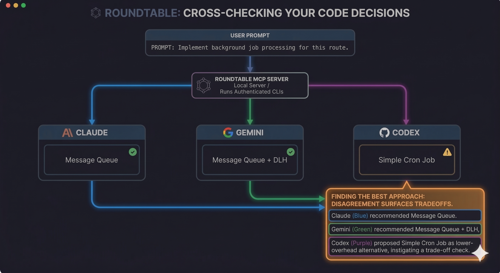

# Roundtable

> **New:** [What is Roundtable? →](https://tejgandham.github.io/roundtable/) — a one-page explainer.

How many times this week did you ask a second model?

You have access to Antigravity, Copilot, Codex, Claude, Gemini — you may even be paying for more than one. But the tab switch and the copy-paste never happen. So every answer you ship comes from one model's opinion.

One of them has already been wrong in a way you haven't caught yet.

The second opinion exists. The workflow to get it doesn't.

**Roundtable is that workflow.**

## The problem

Not the obvious hallucination. The dangerous one: correct pattern, correct library, wrong detail. A parameter name that changed two versions ago. A concurrency fix that looks elegant and quietly reintroduces a race condition. An infrastructure block that reads like real documentation but doesn't exist.

It compiles. It passes your smell test. It ships. You find out at 2am.

You cross-check sometimes. Just not often enough to catch the subtle ones — because cross-checking means re-establishing context in another terminal, copy-pasting a prompt, waiting, and mentally diffing two walls of prose. So you only do it for decisions you *already* think are risky. The ones that burn you are the ones you didn't think were risky.

## What it does

Roundtable is an MCP server that sends your prompt to Antigravity, Copilot, Codex, Claude, and Gemini CLIs — in parallel — and returns structured JSON with all their responses. One tool call from inside your existing agent. It uses the CLIs already in your PATH, already authenticated. Claude Code spawns it over stdio on demand — no daemon, no open port. Prompts stay in-memory on your machine — Roundtable assembles the role + prompt + file references in-process, hands them to your local CLIs, and never persists or proxies them anywhere else. The CLIs talk to their providers as usual.

You can run the same CLI with different models in a single dispatch. Antigravity for the architecture review, Copilot for a GitHub-grounded read, Claude with Sonnet for the quick sanity check, Codex for an independent take, Gemini as an optional extra lens. Compose your own panel.

Copilot here is the standalone `copilot` binary (GitHub Copilot CLI), not the `gh copilot` extension.

## Why disagreement matters

When models agree, that's useful triage — not proof, but a strong signal you're on the right track.

When they disagree, that's the real value. Disagreement surfaces tradeoffs you would have missed, edge cases one model sees and another doesn't, or a hallucination the others don't share. You don't need four models to be right. You need them to be *different enough* to catch each other.

```json
{
  "antigravity": { "status": "ok", "response": "A worker queue is safest if retries are observable..." },
  "copilot": { "status": "ok", "response": "Lean on the platform — a queue is fine, but check if your host already offers one..." },
  "codex": { "status": "ok", "response": "A cron job is simpler here — the volume doesn't justify a queue..." },
  "claude": { "status": "ok", "response": "Use a message queue — decouples the producer..." },
  "gemini": { "status": "ok", "response": "Use a message queue with dead-letter handling..." }
}
```



Four models agree on the queue. One says it's overengineered. That disagreement is worth more than any single answer.

## When you want them to talk to each other

Sometimes the panel disagrees and you want to know if the disagreement survives a second pass. `roundtable-converge` replays a prior dispatch back through the same panel — each panelist sees the original prompt PLUS the other panelists' answers (under redacted `peer-1`, `peer-2`, … aliases so identity bias doesn't bleed in) and is asked for:

- **(a)** hold or revise their stance
- **(b)** which peers they agree with
- **(c)** a draft converged recommendation

When to reach for it:
- Canvass / deliberate / crosscheck returned divergent answers and you want a synthesis round before deciding.
- One panelist surfaced an edge case the others missed — feed it back and see who picks it up.
- You want a soft consensus signal: how much of the panel converges on the same recommendation in (c) once they've seen each other.

When NOT to reach for it:
- The panel already agreed in round one — converge will mostly produce restated agreement.
- You only ran one model — no peers to converge with.
- You want a fresh angle, not a synthesis. Use `roundtable-critique` or a different role instead.

Strong agreement after the panel has seen each other is a meaningfully different signal from independent agreement in round one.

## Selective dispatch

Route architecture decisions to the heavy models. Route boilerplate to the fast ones. The `agents` parameter takes a JSON array — pick exactly who sits at the table, and control your cost. Cross-platform: Linux and macOS.

`ROUNDTABLE_DEFAULT_AGENTS` configures which agents run by default. A per-call `agents` parameter always overrides.

```bash
# Only use Antigravity and Claude by default
ROUNDTABLE_DEFAULT_AGENTS='[{"provider":"antigravity"},{"provider":"claude"}]'
```

## MCP Tools

Each tool assigns a role to each agent, shaping its system prompt.

| Tool | Role | Use Case |
|-|-|-|
|`roundtable-canvass`|default|Canvass the panel — independent parallel responses|
|`roundtable-deliberate`|planner|Deliberate a hard problem — conclusions + alternatives + confidence|
|`roundtable-blueprint`|planner|Blueprint an implementation — phases, deps, risks, milestones|
|`roundtable-critique`|codereviewer|Adversarial critique — find flaws, risks, weaknesses|
|`roundtable-crosscheck`|mixed roles across the panel|Crosscheck from multiple vantage points|
|`roundtable-converge`|default|Replay a prior dispatch — each panelist sees the others' answers under redacted `peer-N` aliases and produces (a) hold-or-revise stance, (b) agreement list, (c) draft converged recommendation|

All tools (except `roundtable-converge`) support an `agents` parameter for selective dispatch. `roundtable-converge` derives its panel set from the `prior_result` it replays.

## Get it

Grab the latest build for your platform from the [Releases](../../releases) page — each archive contains the binary plus its skill file. Point your favorite agent at it, then ask all of them the question you were about to ask just one. See where they disagree. That's where you should look twice.
